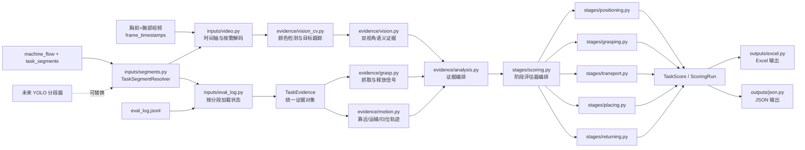

# 运行脚本

```bash
# 默认：找 data_dir 下的 Excel → 原地修改
python3 auto_score.py --data-dir xxx/xxx/action-step_*

# data_dir 下没有 Excel 时，用 --excel 指定模板复制后再修改
python3 auto_score.py --data-dir xxx/action-step_* --excel 机械臂抓取模型反馈评分模型.xlsx

# 只运行评分引擎并输出 JSON，不要求 Excel 存在
python3 auto_score.py --data-dir xxx/action-step_* --no-excel

# 查看评分规则
python3 auto_score.py --explain
```

运行后会同时生成：

- 填好 S1~S5 的 Excel；
- `auto_score_summary.json`（分数、置信度、证据、待复核原因）；
- 每个评分单元格的 Excel 批注（便于人工追溯）。

JSON 以 task 为中心组织：`tasks[].stages` 包含 S1～S5 的分数、独立置信度、
评分证据和复核原因，`tasks[].task_evidence` 包含该 task 的多模态综合证据。

视频增强使用 `opencv-python-headless` 直接读取视频。缺少视频或 OpenCV
无法读取视频时会自动退化为传感器保守评分，并把受影响维度标记为待人工复核。

# 数据映射关系

|数据源|用途|
|---|---|
|`data_dir/` (action-step_*)|6 个 task 的推理评测数据|
|`eval_log.jsonl`|逐帧机器人状态（EE位姿、关节电流、wrench 力、夹爪状态）|
|`task_segments.jsonl`|多个 task 的起止帧分割|
|`machine_flow.jsonl`|帧 → task_segment_index 映射|
|`evaluation_report.json`|全局指标（延迟、平滑度、碰撞分等）|
|`trajectory.parquet`|轨迹数据|
|`videos/cam_mid_chest.mp4`|目标/盒子场景、物体世界运动、释放后落点|
|`videos/cam_left_wrist.mp4`|物体进入夹爪、保持、释放前掉落|
|`videos/frame_timestamps.jsonl`|以真实采集时间对齐视频、状态、抓取和释放事件|
|`device_health*.json*`|反馈超时、同步与数据可靠性门控|
|`机械臂抓取模型反馈评分模型.xlsx`|目标输出：6列 × 5维度的评分表（原地修改）|

# 评分维度与量化映射策略

|维度|分值范围|自动判定依据|
|---|---|---|
| S1定位 | 0~4| has_motion + approach_quality + 定位时间 |
| S2抓取 | 0~3| UDP真实闭合 + 腕部夹爪ROI保持 + EE抬升 + 去基线力/电流 |
| S3搬运 | 0~2| 玩具是否随夹爪移动并接近盒口 |
| S4投放 | 0~3| 释放事件 + 玩具最终与盒子轮廓的空间关系 |
| S5归位 | 0~2| 相对当前 task 第一帧的离开—返回轨迹 + xy/z误差 + 时间 + 夹爪状态 |

# 各维度的评分规则细节

S1定位：
- no_motion → 0 (10s内几乎没有动作)
- 腕部视角未确认朝目标靠近 → 1 (无规律乱动)
- 目标接近夹爪或发生闭合，但没有稳定抓取 → 2 (定位偏移/到达附近)
- 稳定抓取且 5~10s 到达 → 3 (缓慢准确定位)
- 稳定抓取且 5s 内到达 → 4 (快速准确定位)

S2抓取：
- 无抓取相位 → 0 (未抓取)
- 已闭合但未确认物体进入夹爪，或物体没有随夹爪抬升 → 1 (抓取失败)
- 确认物体进入夹爪并抬升 ≥2cm，随后在正常释放前持续脱离 → 2 (抬起掉落)
- 确认获取物体 + 抬升 ≥5cm + 腕部持续保持 + 有效运输 → 3 (稳定抓取)

腕部偶发漏检、夹爪完全闭合、仅 EE 上升均不能单独证明“抬起掉落”。

S3搬运：
- 无 grasp_transport → 0 (未搬运)
- transport < 0.05m → 0 (未搬运)
- 有transport但未到放置区 → 1 (搬运未到位)
- transport_to_place = True 或 retract_dist ≥ 0.10m → 2 (到达目标上方)

S4投放：
- 无夹爪释放且无放置相位 → 0 (无投放)
- 有放置动作但不在 ROI 内 → 1 (落于盒外)
- 运到附近但未精确入盒 → 2 (落于盒边)
- place_at_box = True → 3 (准确入盒)

S5归位：
- 每个 task 以其帧号最小的第一帧 EE 位姿为独立原点，不跨 task 共用原点
- withdraw_home_dist > 0.20m 且无撤回 → 0 (未归位)
- 有撤回但距离 > 0.12m → 1 (归位偏差)
- withdraw_home_dist ≤ 0.12m → 2 (成功归位)

# 执行流程



评分引擎的正式边界为 `pipeline.evaluate_data_dir()`：输入 action_step 目录，
输出与 Excel 无关的 `ScoringRun`。其中每个 task 使用统一 `TaskEvidence`，
每个 S1～S5 阶段输出 `StageResult`（分数、置信度、证据、缺失证据、复核原因）。
Excel 和 JSON 均为下游输出适配器。

1. `inputs/` — 通过可替换的 `TaskSegmentResolver` 识别分段，再读取日志、对齐和解码视频
2. `evidence/` — 提取运动、抓取、事件链和双视角视觉证据，生成 `TaskEvidence`
3. `domain/rules_v5.py` — v5 的全部阈值、评分条件、模态权重和置信度策略
4. `stages/` — 五个阶段直接消费统一证据，分别计算分数与置信度
5. `pipeline.py` — 编排证据提取与五阶段评分，不依赖具体输出格式
6. `outputs/` — Excel 与 JSON 输出适配器

# 项目文件结构

```
auto_score.py                       # 命令行入口
pipeline.py                         # 与输出格式无关的评分引擎入口
domain/
│   ├── models.py                   # TaskEvidence、StageResult、TaskScore
│   └── rules_v5.py                 # 完整、版本化的 v5 规则唯一来源
inputs/
│   ├── eval_log.py                 # 状态日志与 task 分段加载
│   ├── segments.py                 # 可替换的 task segment 识别接口与当前日志实现
│   └── video.py                    # 视频时间轴与按需解码
evidence/
│   ├── analysis.py                 # 多模态证据编排
│   ├── events.py                   # 动作事件链
│   ├── grasp.py                    # 抓取与释放信号
│   ├── motion.py                   # 靠近、运输、撤回和归位轨迹
│   ├── vision.py                   # 双视角语义证据
│   └── vision_cv.py                # OpenCV 检测与跟踪
stages/
│   ├── common.py                   # 阶段置信度与审计结果
│   ├── positioning.py              # S1 定位
│   ├── grasping.py                 # S2 抓取
│   ├── transport.py                # S3 搬运
│   ├── placing.py                  # S4 投放
│   ├── returning.py                # S5 归位
│   └── scoring.py                  # 五阶段编排
outputs/
│   ├── config.py                   # Excel 布局与文件名
│   ├── console.py                  # 终端摘要与复核信息
│   ├── excel.py                    # Excel 输出
│   └── json.py                     # JSON 审计摘要
tests/
├── unit/
│   ├── evidence/                   # 证据提取测试
│   └── stages/                     # 阶段评分测试
└── test_pipeline.py                # 端到端边界测试
```

## Task segment 识别器切换

评分流水线不直接依赖 `machine_flow.jsonl` 或 `task_segments.jsonl`。
默认的 `RecordedTaskSegmentResolver` 会读取这些已记录的边界；未来
YOLO 分段器只需实现 `TaskSegmentResolver.resolve()`，返回统一的
`TaskSegmentAssignments`，即可在调用 `evaluate_data_dir()` 时注入，无需修改
视觉证据、事件链或 S1～S5 评分规则。

# v5规则（domain/rules_v5.py）

所有评分和证据判定参数集中在 `V5RuleSet`：

| 参数 | 默认值 | 作用 |
|------|--------|------|
| `motion_ee_excursion_m` | 0.01 | EE 相对起点移动多远才算有运动 |
| `jc_grasp_rise_min` | 900 | 无可靠夹爪反馈时的抓取候选阈值 |
| `approach_z_drop_m` | 0.04 | Z 降多少才算靠近目标 |
| `withdraw_home_xy_m` | 0.10 | 归位水平容差 |
| `place_roi_xy_m` | 0.06 | 放置 ROI 的 XY 容差 |
| `V5_STAGE_SPECS[].confidence` | 分阶段 | S1～S5 独立的模态权重、缺失惩罚和复核阈值 |

# 当前局限与复核策略

1. 轻量视觉针对当前“红色玩具 + 黄色盒子”布景；颜色、光照或目标类别变化后需重新标定，或替换为正式分割模型。
2. S1 的 2cm/3cm 条件仍需要相机内外参和桌面坐标标定；当前仅在稳定抓取能够反证到位时给 3/4 分。
3. v5 对“有马无盒/有盒无马”没有 N/A 规则。当前 S3/S4 保守记 0，并在摘要中提示应增加独立鲁棒性指标。
4. v5 的 S5 夹爪状态存在“张开/闭合”文字冲突；当前 `V5RuleSet.return_grip_open_required` 按评分细则 E23 采用“张开”。
5. 设备状态反馈超时、遮挡或视觉/传感器冲突不会静默给高分，而会降低置信度并要求人工复核。
6. 腕部深度视频当前有效像素较稀疏，尚未作为抓取成功的硬证据。
