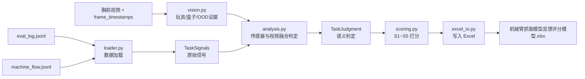

# 运行脚本

```bash
# 默认：找 data_dir 下的 Excel → 原地修改
python3 auto_score.py --data-dir xxx/xxx/action-step_*

# data_dir 下没有 Excel 时，用 --excel 指定模板复制后再修改
python3 auto_score.py --data-dir xxx/action-step_* --excel 机械臂抓取模型反馈评分模型.xlsx

# 查看评分规则
python3 auto_score.py --explain
```

运行后会同时生成：

- 填好 S1~S5 的 Excel；
- `auto_score_summary.json`（分数、置信度、证据、待复核原因）；
- 每个评分单元格的 Excel 批注（便于人工追溯）。

视频增强使用 `opencv-python-headless` 直接读取视频。缺少视频或 OpenCV
无法读取视频时会自动退化为传感器保守评分，并把受影响维度标记为待人工复核。

# 数据映射关系

|数据源|用途|
|---|---|
|`data_dir/` (action-step_*)|6 个 task 的推理评测数据|
|`eval_log.jsonl`|逐帧机器人状态（EE位姿、关节电流、wrench 力、夹爪状态）|
|`task_segments.jsonl`|多个 task 的起止帧分割|
|`machine_flow.jsonl`|帧 → task_segment_index 映射|
|`evaluation_report.json`|全局指标（延迟、平滑度、碰撞分等）|
|`trajectory.parquet`|轨迹数据|
|`videos/` (4路视频)|视觉回看校验 & 首帧目标检测|
|`机械臂抓取模型反馈评分模型.xlsx`|目标输出：6列 × 5维度的评分表（原地修改）|

# 评分维度与量化映射策略

|维度|分值范围|自动判定依据|
|---|---|---|
| S1定位 | 0~4| has_motion + approach_quality + 定位时间 |
| S2抓取 | 0~3| 渐进闭合事件 + 空夹拦截 + 玩具随动 + 去基线力/电流 |
| S3搬运 | 0~2| 玩具是否随夹爪移动并接近盒口 |
| S4投放 | 0~3| 释放事件 + 玩具最终与盒子轮廓的空间关系 |
| S5归位 | 0~2| 明确的离开—返回轨迹 + xy/z误差 + 时间 + 夹爪状态 |

# 各维度的评分规则细节

S1定位：
- no_motion → 0 (10s内几乎没有动作)
- wander / 无对齐 → 1 (无规律乱动)
- 有靠近但 path_efficiency < 0.3 或 align < 0.5 → 2 (定位偏移)
- slow approach (5~10s到达) → 3 (缓慢靠近)
- fast approach (<5s + path_efficiency≥0.3) → 4 (快速准确定位)

S2抓取：
- 无抓取相位 → 0 (未抓取)
- 有抓取相位但无接触 → 1 (抓取失败/抓空)
- 有接触但抓起后掉落(transport < 0.08m) → 2 (抬起掉落)
- 有接触 + 稳定transport → 3 (稳定抓取)

S3搬运：
- 无 grasp_transport → 0 (未搬运)
- transport < 0.05m → 0 (未搬运)
- 有transport但未到放置区 → 1 (搬运未到位)
- transport_to_place = True 或 retract_dist ≥ 0.10m → 2 (到达目标上方)

S4投放：
- 无夹爪释放且无放置相位 → 0 (无投放)
- 有放置动作但不在 ROI 内 → 1 (落于盒外)
- 运到附近但未精确入盒 → 2 (落于盒边)
- place_at_box = True → 3 (准确入盒)

S5归位：
- withdraw_home_dist > 0.20m 且无撤回 → 0 (未归位)
- 有撤回但距离 > 0.12m → 1 (归位偏差)
- withdraw_home_dist ≤ 0.12m → 2 (成功归位)

# 执行流程



1. `loader.py` — 读取 eval_log.jsonl + machine_flow.jsonl，按 task 分组提取 EE / JC / grip / fz 信号
2. `analysis.py` — 检测抓取事件（夹爪闭合→JC尖峰→z_min三级策略），划分靠近/撤回阶段，生成语义判定
3. `scoring.py` — 将语义判定映射为 S1~S5 分值
4. `excel_io.py` — 打开 data_dir/机械臂抓取模型反馈评分模型.xlsx，写入评分后原地保存
5. 同时输出 `auto_score_summary.json` 方便程序读取

# 项目文件结构

```
auto_score.py       # 主入口（CLI + 流程编排）
config.py           # 配置文件（所有阈值、映射、常量）
models.py           # 数据结构（TaskSignals, TaskJudgment）
loader.py           # 数据加载（eval_log.jsonl 解析）
analysis.py         # 信号分析（抓取检测、阶段划分、语义判定）
vision.py           # OpenCV 视频读取、HSV 分割、形态学去噪与轮廓分析
scoring.py          # 评分映射（S1~S5 打分函数）
excel_io.py         # Excel 读写
```

# 配置文件（config.py）

所有可调参数集中在 `config.py`，修改无需动核心逻辑：

| 参数 | 默认值 | 作用 |
|------|--------|------|
| `MOTION_EE_PATH_M` | 0.20 | EE 走多远才算"有运动" |
| `JC_GRASP_RISE_MIN` | 600 | JC 比基线高多少才算抓取 |
| `APPROACH_Z_DROP_M` | 0.04 | Z 降多少才算"靠近目标" |
| `WITHDRAW_HOME_M` | 0.12 | 离起点多近才算"归位" |
| `PLACE_ROI_XY_M` | 0.06 | 放置 ROI 的 XY 容差 |
| `EXCEL_FILENAME` | 机械臂抓取模型反馈评分模型.xlsx | 评分 Excel 文件名 |
| `EXCEL_SHEET_NAME` | 推理 (2) | Excel sheet 名 |

# 当前局限与复核策略

1. 轻量视觉针对当前“红色玩具 + 黄色盒子”布景；颜色、光照或目标类别变化后需重新标定，或替换为正式分割模型。
2. S1 的 2cm/3cm 条件需要相机内外参和桌面坐标标定；未标定时 S1=3/4 会自动标记复核。
3. v5 对“有马无盒/有盒无马”没有 N/A 规则。当前 S3/S4 保守记 0，并在摘要中提示应增加独立鲁棒性指标。
4. v5 的 S5 夹爪状态存在“张开/闭合”文字冲突；当前按评分细则 E23 采用“张开”，可在 `config.py` 中切换。
5. 设备状态反馈超时、遮挡或视觉/传感器冲突不会静默给高分，而会降低置信度并要求人工复核。
